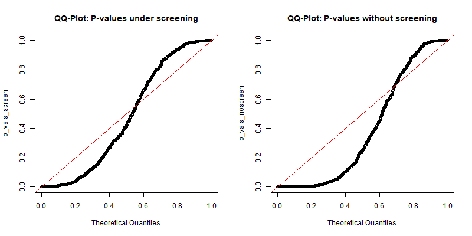
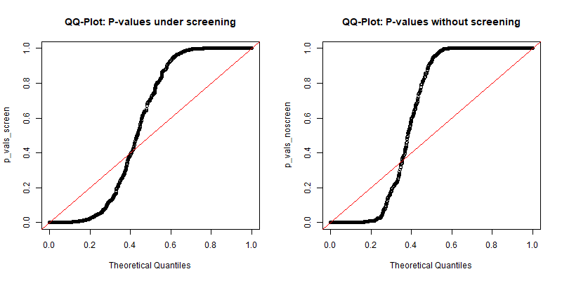
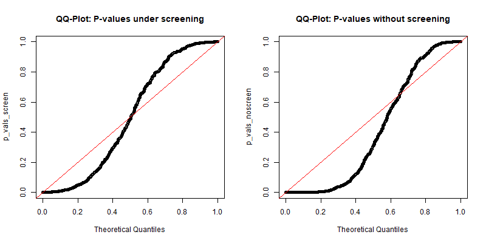
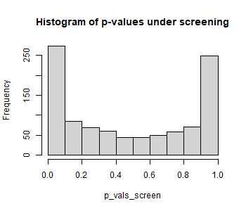
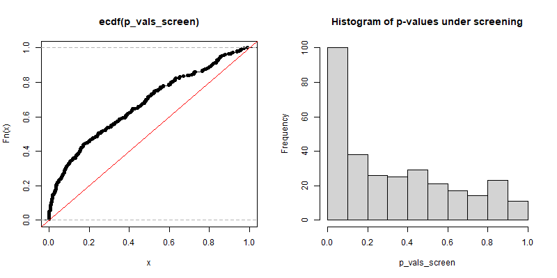
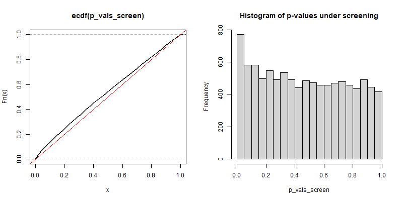

---
title: "Multicarving"
author: "Filip Ilic & Paul Schlossmacher"
date: "2024-03-13"
output: pdf_document
---

```{r setup, include=FALSE}
knitr::opts_chunk$set(echo = TRUE)
```

# Questions for Christoph:
### Choice of variance estimator for normalizing
When normalizing the data at the beginning, we did it with the estimator of the standard deviation, which divides by n instead of n-1, because Prof. Bühlmann did it like this in his lecture.
Is this correct and does it have any consequences in the following? Maybe incompatibility with other packages, which use a different estimator?
I'm guessing that it shouldn't be an issue because the whole columns are still the same
up to multiplicity regardless of the method, but I'm not sure.


### Regarding \(n_A /n_B:\) 
On p. 3, Drysdale writes that the group A gets used for screening (i.e is the bigger group) and that
$$\hat\beta^{Carve}=w_A*\hat\beta^{Split} + w_B*\hat\beta^{Posi}$$
But in Lemma 3.2 on p. 4 he writes in the definition of $\hat \beta_j$:
$$n_B*\eta^T_{B, M_j}y_B$$
So here it seems like in fact the coefficient $\beta^{Split}_j=\eta^T_{B, M_j}y_B$ gets multiplied with the smaller set of the split, i.e. group B.


### Regarding the choice of $\tau_M^2$ in Lemma 3.2
In Lemma 3.2 Drysdale implements $\sigma_1^2$ with one $\tau_M^2$ for both the POSI and the SPLIT part. In our implementation we chose $\tau_M^2=\sigma^2$ with $\sigma^2$ assumed to be known and $y\sim N(X\beta^0, \sigma^2I_n)$. However in his code of _lasso.py on row 302, Drysdale uses two different $\tau$ for POSI and SPLIT: $\tau_M$ for $\tau_1$ (for the distribution of $\beta^{SPLIT}$), but uses some scaled version for $\tau_2$ (for the truncated distribution of $\beta^{POSI}$). The choice of this scaling is unclear to us.


### Regarding \(V^{-(z)} /V^{+(z)}\):
When calculating the truncation limits $V^-(z)$ and $V^+(z)$, we tried to do it similarly to what Drysdale does in his code.
Namely, we take a normalized row of the Moore Penrose Inverse of $X_{M_A}$ together with the sign of $\hat\beta$ as the direction $\eta$, calculate $V^-(z)$ and $V^+(z)$ as proposed in Lee et al., but then at the end we rescale $V^-(z)$ and $V^+(z)$ by the length of the directions we considered. Why is the rescaling necessary and why is it mentioned nowhere in the papers?

### Set.seed()
Is our practice for setting seeds in the while loops in the simulation files ok? The function still is a bit of a mystery to both us.

### Constant fraq
Would it be "fair" to compare Drysdale's p-values with Christoph's p-values, when having them at different fractions (i.e split-rates) to ensure Drysdale's $\hat \beta^{Carve}$ to exist?

# Theoretical notes:

## Notes to ourselves:
### Conditioning on s:

I asked Filip on Friday how you actually compute things when you only want to condition on one sign pattern.
Lee makes this clear on p. 15:
"Conditioning on the signs means that we only have to compute the interval [V-s(z), V+s(z)] for the sign pattern s that was actually observed."

We see right under Theorem 5.3 in Lee, that V-s(z) and V+s(z) are defined through A=As and b=bs. And s influences the definitions of A1(M,s) and b1(M,s) respectively.

Since s is in {-1,1}^|M|, it's only defined for variables that are actually selected, so the computation of the signs is straightforward (I mention this, because we had some confusion with a similar thing in another paper where we had s in [-1,1]^|M| or sth like this )

Question: Which beta^hat are we actually using though to get the signs?
A priori all of beta^carve, beta^POSI and beta^SPLIT seem at least viable

Thinking about it, I guess that since we are talking about M (i.e. M_A) all the time, it is probably  beta^Split, which is also the beta we are working with in the code above. In fact, Filip already  implemented it exactly like that above.


### Multiple polyhedra:

Question: If we only have eta in R^nx1 for a single polyhedron and eta_M in R^nx|M| for the union of polyhedra:
What eta_M do we actually use now when we additionally condition on the signs, to only have one polyhedron?


### Definition of \(m_j(x)\) in Lemma 3.1
Drysdale writes $m_j(x)=(x-\theta_x)/\sigma_x$. Since $\theta_x, \sigma_x$ aren't defined, I guess he means:
$$m_j(x)=(x-\theta_j)/\sigma_j$$


# Changes Made
## Paul Sunday, 24rd March:
* Moved the theoretical notes over from carve_linear to this markdown file

* Try whether we get reasonable values from the SNTN Cdf when putting in very "average" values
** For z=0, 1,-1 respectively, we got the values 1/2, 0.86, 0.13, which seems reasonable (not sure how much the standard deviation rules of the normal distribution still apply here)

* Added set.seed(42) to carve.linear to have replicability while debugging.

* Question: Are p-values of all 0 actually a problem? Isn't that exactly what we'd like when testing for betas, that are as big as the ones we get in our examples? - Let's compare the p-values for all 9 entries of our $\hat\beta^{Carve}$
** For $\hat\beta^{Carve}_4=139.116200$ we get: 0
** For $\hat\beta^{Carve}_3=-7.379114$ we get: 1
** Problem: When running the code for the Toeplitz example, we get $\hat\beta^{Carve} \in \mathbb{R}^9$, but when calculating the p-values, we only get 6. Where do the 3 values get lost?
*** Answer - this doesn't happen, just seemed so, because I ran it twice back to back and actually got differently sized $\beta$s due to the randomness of the Lasso.

* Division by 0 in sntn_cdf:
** This happens $\iff \Phi(\delta)=\Phi(\omega)$. In theory this shouldn't happen, because $\Phi(\delta)=\Phi(\omega) \iff a=b$ with $a,b$ being the truncation limits of the truncated normal and it wouldn't make sense for them to be equal. However for "big" values for a and b (Already for a>=6), in R $\phi(a)=1$, therefore the division by 0 occurs.
** Remedy: Since in this case even in theory, i.e. without computational approximation to 1, $\Phi(\delta)-\Phi(\omega)$ would be very small, as a consequence the whole of F would be very big, i.e (almost) equal to 1. Therefore: We implemented an if clause that sets F(z) to 1, if $\Phi(\delta)=\Phi(\omega)$
** However: In these cases it also tends to be that the numerator = 0, i.e $B_{\rho}(m_1(z), \delta)=B_{\rho}(m_1(z), \omega)$ because of the same reasons as above. Since we don't know which one of numerator and denominator is actually bigger in this case, we set the probability to 0 by hand, which results in the p-value being set to 1. While this is unsatisfactory, it is the more conservative decision.
** Up for discussion: Maybe leaving it as NA would actually be the best decision?


## Paul Monday, 25th March:

* Started running the simulation studies as discussed with Filip yesterday in the file called "Power Studies Toeplitz". I used a Toeplitz design again, but with lower noise and more active variables ($s_0=15$)

* We saw immediately that under the "right" conditions, $\hat \beta^{Drysdale}_{Carve}$ has the anticipated issue of not being able to compute $\beta^{Split}$ due to rank issues.

* Note: I only saw that the computation crashed, but I don't know with 100% certainty whether this actually was the issue. *TODO*: Implement STOP messages, which would confirm this.

* I then went on to use a 60-40 split instead, on which $\beta^{Drysdale}_{Carve}$ could then be computed again - as well as the respective p-values. I also calculated the p-values for Christophs carving function.

* Then I started creating a "Confusion matrix" for Type I & II error. So far I've only done this for Christophs $\hat\beta^{Carve}$ though.

* *TODO*: Do the same for Drysdale as well - should be quite straightforward I think

* *TODO*: If possible, maybe try running a simulation that does all of the above e.g. a 100 times to see some proper results as far as power is concerned. Note: Computing time might be an issue, since even running Christophs carve.lasso only once in this specific Toeplitz example with many active variables took about 1 minute.

## Filip Monday, 25th March:
Started with some experiments around the robustness of our estimators. As carve.lasso gives alot of "whitening constraints not fulfilled" errors on most of the seeds that I've tried, my new idea is to use Christoph's multi.carve, but with parameters set as such that it corresponds to regular carving. 
I checked also whether the choice of seed in the carving_simulation file propagates through to the functions and this is indeed the case. Furthermore, it was interesting to see that the selection events are not the same when comparing sel.models from carve_C and the chosen indices from our own split_select inside of carve.linear. This suggests that we still do not perform all constraint checks the same as it should be done for carve.lasso, which maybe explains the not fulfilled whitening constraints when calling carve.lasso on our own selection event. 
So an idea would be to take the selection event imposed by multi.carve and use it on carve.linear.
I adapted multi.carve to return beta and lambda from its selection event, as well as carve.linear to not perform its own selection, but get it as parameters as carve.lasso does. To match the dimension of pvalues from multi.carve I set carve.linear's output to have also length 200, with ones at all indices, which were already excluded from selection.
Seed 41 and fraq 0.9 gives a singular matrix error for carve.linear, at this seed there are many selected variables, could be that we encounter here the problems mentioned by Christoph.

## Filip Tuesday, 26th March:
* Implemented stop messages in carve.linear which appear if the moore penrose inverse is not well defined due to singularity of $X_{A,M_A}^TX_{A,M_A}$ or $X_{B,M_A}^TX_{B,M_A}$
* Added confusion matrix example for Drysdales p-values in the style of what Paul did with Christophs p-values.
* Had major problems with replicability of carve.linear. The two selection events are different when comparing the split.select output inside of "Power Study Toeplitz" and the split.select output from inside of carve.linear. To get similar results, the seed has to be set again inside of carve.linear, or maybe be passed as an argument for later automatization.
* Tried setting the seed again before calling carve.linear, but this gives 0 selected variables from Lasso
* carve.linear works perfectly fine when not executing the split and carve.lasso in "Power Study Toeplitz" first. This behaviour seems very weird
* For the first possible comparison of the p_vals_C and p_vals_D it worked to set a different seed before calling carve.linear. This solution is temporary and still needs more investigation
* TODO: We can discuss if it would help to perform the selection only once inside of "Power Study Toeplitz" and adapt carve.linear to get the selection informations passed as arguments as it is in carve.lasso. This seems to be the cleanest solution and gives the most fair comparison. I already did something like that in the branch "Filip fights whitening errors".

## Paul & Filip, 26th March evening
Implemented Power study Toeplitz same fraq to perform data splitting and selection, followed by carve.lasso and carve.linear working on the same selected model. This procedure is done for each chosen fraction and averaged over nsim simulation rounds. To make this work, we had to grant Drysdales carve.linear estimator alot of privileges by performing model selection as many times as necessary for carve.linear to be well defined. This works fine up to fractions of around 0.7, whereas higher fractions lead to the selection procedure being repeated more than 50 times and thus stop the code execution. All of the simulation data is saved in vectors, such that we get for each fraction an average confusion matrix at the end. We also keep track of the power and the type I error, calculating them by

\begin{align*}
  \text{power} &= \frac{|\{\text{H}_0\text{ false and we rejected}\}|}{s}\\
  &\\
  \text{type I error} &= \frac{|\{\text{H}_0\text{ true and we rejected}\}|}{p-s}
\end{align*}

where s is the number of true active predictors and p the number of total predictors. These quantities are plotted against each other after the simulation has finished.
During the simulation it happened sometimes that the model selection did select any predictors. In this case we forced the simulation to repeat the selection event.

## Meeting Christoph Wednesday, 27th March
* Regarding the choice of variance estimator for normalizing: it seems to not make any difference, as this scaling will just be absorbed into the choice of lambda during model selection.
* Regarding $n_A /n_B$: this is a mistake in Drysdales paper.
* Regarding the choice of $\tau_M^2$ in Lemma 3.2: It is ok for us to just set it to $\sigma^2$, but we can do more experiments on that as described below in the further steps.
* Regarding $V^{-}(z)$ and $V^{+}(z)$: We should not mix our understanding with what Drysdale does. But it would still be interesting to compare his scaling approach when calculating $V^{-}(z)$ and $V^{+}(z)$ with the generic design from Lee's paper that avoids scaling.

# Further steps
* Perform an analysis on the distribution of the p-values obtained from the inactive variables after fitting carve.linear. If screening is given, they should follow a uniform distribution. We could compare their distribution even in the case when screening is not given and look how much they differ.
* Once the p-value distribution comparison is set, we can play around with our calculation of $V^{-}(z)$ and $V^{+}(z)$, leaving out scaling for example, and compare the resulting distributions to see which one matches a uniform best. Here is also the point where we can try to take the scaled version of $\tau_M^2$ for the variance of the truncated normal distribution and look again how the distribution of p-values compares.
* As of Paul's proposal, we can try to test how much improvements does carve.lasso give when used on higher fractions as carve.linear would allow.
* The repetition of selection events in case of no selected active variables is disputable. Hence we could say that we count them too into our power and type I error vectors by just skipping this simulation round.
* We could try to implement some kind of optional FWER control into carve.linear. For example through a Bonferroni correction
* We could ask for permission to the D-MATH computation hardware and scale up our simulations for a more thorough comparison between carve.lasso and carve.linear

## Filip, Thursday April 4th
* I created a new branch called Inspection of p-value distribution. In this branch is a new file p_vals_distribution
* I used fraq = 0.7 and sigma = 1.9 which gave empirically a similar amount of successful screening as not successful screening
* The simulation loop is still not optimized, as it runs as long as we have enough p-values under screening as well as without screening. We could have for example also just focused on one of them at a time. For example lowering the sigma and analysing p-values under screening followed by higher sigma and analysis of p-values without screening.
* As discussed we only collect p-values from the selected ones which are truly inactive
* I created QQ-plots comparing the distribution of the p-values to the theoretical uniform distribution. An easier solution would be to just plot the empirical distribution of our p-values, which should already form a straight line if it is truly uniform(I didnt think of that straight away)
* First i did plots for the carve_linear version that we used in our carve.lasso comparison and got the plots in figure 1. Next i tried to use the scaled variance eta_var, which is the one that drysdale used in his python code and got the plots in figure 2. These seem to be even worse.
* Lastly I changed the calculation of the truncation limits in carve_linear to not perform normalization, as would be the natural solution following Lee's paper. This is pictured in figure 3. The resulting p-values appear to have a similar distribution as our initial implementation from figure 1. Additionally I plotted a histogram for this case, to get a better visualization of the distribution of the p-values.
* Next steps: Maybe perform statistical tests for the hypothesis that we actually do not have uniform p-values as we should have. Other than that we would need to go again over the theory the check where our implementation of carve.linear went wrong. Just by looking at the QQ-plots it seems to be way off, but symmetric around the median with the median being the same as expected from a uniform distribution.

## Filip Tuesday, April 9th
* During meeting with Paul we corrected the normalization at the beginning of carve.linear, which was performing its normalization only on the last column
* Analyzed code of Drysdale again. Found a mismatch in our p-value definition at the end of carve.linear. We should account for the signs of beta_select, as the p-values should capture the extreme realizations in both the positive and negative directions. The other choice which would be more familiar to me, is to perform a two sided test.
* Found that carve linear sometimes returns p-values outside the range $[0,1]$, potentially highlighting some mistake in the implementation of SNTN_cdf distribution. The deviations where very small, mostly around $10^{-15}$, suggesting hopefully only some numerical issues. Drysdale clips his cdf values to $[0,1]$, which makes me believe that he observed a similar behaviour. I implemented the same clipping, but with additional warnings.
* I created a new file "pvals_sceened_distribution"" which serves the purpose of analyzing the distribution of p-values of truly inactive coefs given screening. For this I lowered the variance in the data generation to obtain higher screening probability and faster p-values accumulation in the simulation loop. We get plots of the empirical cdf, which should optimally be a diagonal line, and a histogram.

## Filip Thursday, April 11th
* Added a SNTN_pdf to SNTN_distribution for visualization purposes. As the sum of two gaussians is gaussian, the pdf looks gaussian when choosing the truncation limits large. We get strongly deviating distributions from a gaussian by changing the variance of the TN distribution and lowering its truncation limits, as this will put alot of mass around the mode. Some playing around with the parameters suggests that the SNTN pdf works as it should. The cdf is a bit harder to analyze visually, but it seems to reflect the shape of the pdf well.
* Added all the inputs for SNTN_CDF to be returned by carve_linear for debugging purposes.
* Carve_linear has now the option to choose if we want normalization of truncation limits and TN variance (following Drysdales approach) or no normalization following the paper of Lee et al. directly.
* Found a mistake in implementation of truncation limit normalization when comparing again to Drysdales code, mainly line 224 in _lasso.py also swaps the corresponding entries of vlo and vup at the positions where we had flipped the signs
* Found that vlo is not always smaller than vup. In many cases all of vlo's entries are higher than the corresponding vup entries. But rarely it happens that some of them are lower and others higher, which indicates that just swapping vlo with vup is not the right solution. To see this, run pvals_screened_distribution and check the warnings.
* When looking at the vlo, vup entries you see that many are around zero and the rest just explode to very high numbers.
* If we are going to ask Christoph for some help, we need a bit clearer code. I added some function parameter documentation in SNTN_CDF and carve_linear and removed some unnecessary function inputs, like args.model.selector, which were not used by now

```{r, echo=FALSE,fig.cap="QQ-plots performed with our initial version of carve.linear, which was used to compare with carve.lasso from Christoph. Both plots use sample_size 1000"}

```

```{r, echo=FALSE,fig.cap="QQ-plots performed with our initial version of carve.linear, where only the variance of the truncated normal distribution has a changed paramater from $\\tau_M = \\sigma^2$ to the scaled eta_var from Drysdale's Code. Both plots use sample_size 1000"}

```

```{r, echo=FALSE,fig.cap="QQ-plots performed on p-values from carve.linear which did not normalize in the computation of the truncation limits. Both plots use sample_size 1000"}

```

```{r, echo=FALSE,fig.cap="Histogram of p-values under screening obtained from carve.linear without normalization of truncation limits."}

```


## Paul Monday, April 15th

Notes:

* Regarding the normalization: Drysdale also does y_M = self.y_screen - self.y_screen.mean() in his _inference_on_screened function.

Changes in carve_linear_clean:

* Changed the variable name sigma to sigma_squ where necessary to avoid confusion.

* Deleted the checks for well-definition of the Moore-Penrose Inverse as already suggested by Filip.

* Thoroughly went through all the calculations for V- and V+ again to find the mistake - without any success yet. 

* Thought: What's weird about our results is both $V^{-}(z)$ and $V^{+}(z)$ being very small (Almost 0). Since: $V^{-}(z)=\max_j \frac{b_j-(Az)_j}{(Ac)_j}$, the fact that $V^{-}(z)$ is close to 0, must mean that either $b_j-(Az)_j$ is very small (in absolute values) or $(Ac)_j$ is very big. However we let carve.linear output those values (In this case the ones for the last entry, so the s-th entry). We saw there by checking the min and max of both that $(Ac)_j \in [-0.14, 0.05]$ and $b_j-(Az)_j \in [-1.7, 3.65]$. Both numbers don't seem unreasonably extreme. We conclude that it must therefore be in the normalization steps etc. where those values become so much smaller. Will investigate this further tomorrow.

* Even though Drysdale does not implement $V^0(z)$, Lee actually says in Lemma 5.1 (p. 10): 

$$
\{Ay\leq b\}=\{V^{-}(z)\leq\eta^Ty\leq V^{+}(z), V^{0}(z)\geq 0\}
$$
So in order to test whether this last condition for V0(z) actually holds, I tried to calculate it explicitly as well, however this led to NAs for both Vlo and Vup - will check in on this tomorrow again.

## Filip & Paul, Wednesdy April 17th:

We discussed possible reasons for the distribution of the p-values under the null hypothesis not being uniform. We chiefly focused on $V^{-}(z)$ and $V^{+}(z)$

### Starting point:
With how things were implemented initially, we almost always got $V^{-}(z)$ > $V^{+}(z)$ with both $V^{-}(z)$ having mostly positive and $V^{+}(z)$ mostly negative values. In absolute values, the majority of both entries were also about 10e+14 big, so very very large.

### Progress made:
After going through the calculations of both numerator and denominator (See again Lee p.10 for details) for $V^{-}(z)=\max_j \frac{b_j-(Az)_j}{(Ac)_j}$, we realised that this was mainly due the denominator $(Ac)_j$ being very small and not due to $b_j-(Az)_j$ being very big.\\
We also noticed that the maximum (or minimum for $V^{+}(z)$) was typically being chosen as follows:

* For $V^{-}(z)$: For the majority of the indices j, $b_j-(Az)_j>0$. Since $(Ac)_j<0$ by definition, in these cases the whole fraction $\frac{b_j-(Az)_j}{(Ac)_j}$<0. However for a few indices we had $b_j-(Az)_j<0$ and thus $V^{-}(z)=\max_j \frac{b_j-(Az)_j}{(Ac)_j}>0$. Of course $\max_j$ was then one of the cases where $b_j-(Az)_j<0$, since the sign of the whole fraction was actually positive here.

* Conversely, the same opposite thing happened for $V^{+}(z)$. Again for a few indices $b_j-(Az)_j<0$ and thus $\min_j$ was chosen such that $V^{-}(z)=\max_j \frac{b_j-(Az)_j}{(Ac)_j}<0$.

* This explains, why in most cases we had $V^{-}(z) > V^{+}(z)$. We solved this issue by excluding all those indices $j$ from the computation of $\min_j$ and $\max_j$, where $b_j-(Az)_j<0$.

* Now we have both $V^{-}(z) < V^{+}(z)$ in all cases (as should be, remember: $V^{-}(z)$ and $V^{+}(z)$ are the respective truncation limits for the truncated normal distribution) and also reasonably big values in the range of $\pm 10$.

However even though we now have reasonable values for the truncation limits, our plots of p-values of the selected but non-truly-active coefficients under the Null hypothesis still do not display a uniform distribution.

```{r, echo=FALSE,fig.cap="Histogram and empirical cdf of p-values under screening obtained from carve.linear without normalization of truncation limits and fixed vlo/vup."}

```

## Meeting Christoph, 18th April

We discussed the problem regarding $V^->V^+$ encounters. He managed to simplify the problem to not fulfilled constraints $Ay < b$. This meant that our code did not perform the same calculations to find $A$ and $b$ as the function constraint.checker used in split_select. We also found that $Ac$ for 
\begin{align*}
  c = \Sigma \eta(\eta^T\Sigma \eta)^{-1}
\end{align*}
should in theory contain only zeros at the entries, where $A_0$ is inside of $A$. This is due to $c$ being aligned with $\eta$ and hence $(I-P_M)\eta=0$ leading to
\begin{align*}
  A_0c = \frac{1}{\lambda} 
  \bigg(\begin{array}{c}
    X_{-M}^T(I-P_M) \\
    -X_{-M}^T(I-P_M)
  \end{array}\bigg)c = 0
\end{align*}
This meant that due to numerical errors, $A_0c$ had very small but not exactly zero entries, making some of our $V^-$,$V^+$ calculations explode without being noticed. We agreed that it makes sense to leave $A_0$ out of the calculations as it should in theory hold that $(X_{A,M_A}^+Y | A_1Y \leq b_1) \perp (A_0Y \leq b_0)$(See Multicarving paper)
We discussed how to use the browser() command for debugging. It breaks the code at the point where it was inserted and lets the user examine the variables inside of the targeted function. We left the meeting with the goal to find the mismatch between our $A$, $b$ calculations with the code from constraint.checker.

### After Meeting
* Found mismatch due to normalization of the data after the selection: In carve_linear we had a normalization of $X$ and $y$ at the beginning, whereas split.select was called directly in pvals_screened_distribution on the unnormalized $X$ and $y$. This led to entirely different base components in our calculation of $A$ and $b$, which in turn led to invalid constraints at the end.
* We now do not have any invalid constraints anymore and no incidents of $V^->V^+$
* The distribution of p-values of truly inactive coefficients given screening is still not a perfectly uniform distribution, but we are getting very close, see figure 6.

```{r, echo=FALSE,fig.cap="Histogram and empirical cdf of p-values under screening obtained from carve.linear without normalization of truncation limits and fixed vlo/vup."}

```


# Further literature
* PDF Selective inference Lee: https://cran.r-project.org/web/packages/selectiveInference/selectiveInference.pdf

